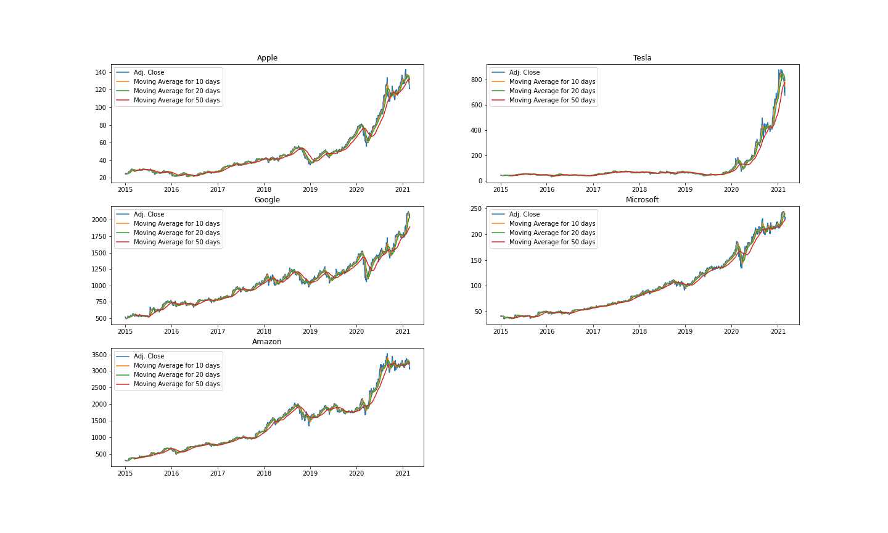
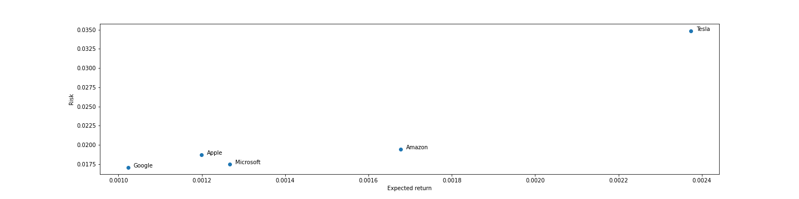
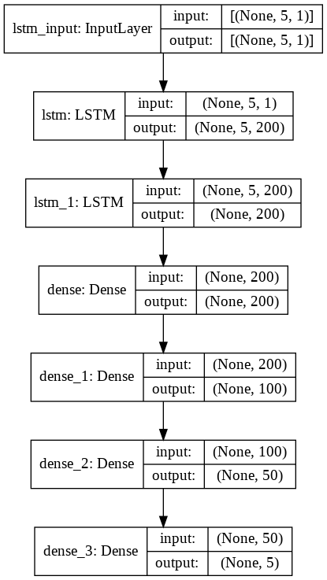

# Stock Price Prediction

## Project Overview
Investment firms, hedge funds and even individuals have been using financial models to better understand market behavior and make profitable investments and trades. A wealth of information is available in the form of historical stock prices and company performance data, suitable for machine learning algorithms to process.

Can we actually predict stock prices with machine learning? Investors make educated guesses by analyzing data. They'll read the news, study the company history, industry trends and other lots of data points that go into making a prediction. The prevailing theories is that stock prices are totally random and unpredictable but that raises the question why top firms like Morgan Stanley and Citigroup hire quantitative analysts to build predictive models. We have this idea of a trading floor being filled with adrenaline infuse men with loose ties running around yelling something into a phone but these days they're more likely to see rows of machine learning experts quietly sitting in front of computer screens. In fact about 70% of all orders on Wall Street are now placed by software, we're now living in the age of the algorithm.

This project utilizes ARIMA models to estimate base RMSE errors and then used Deep Learning-Based models to improve the predictions.
 

## Dataset
Webscraped https://in.finance.yahoo.com using selenium and BeautifulSoup.
 

## Exploratory Data Analysis

#### Closing Price v/s Time

 

#### Histogram plot of Percentage Daily Return 

 

#### Correlation between the stocks daily returns

From the above plot, we can see that Microsoft and Google had the strongest correlation in stocks daily returns.
 

#### Risk v/s Expected Returns

From the above graph, we can see that Tesla has the highest expected returns and the highest risk factor. Google has the lowest expected returns and the lowest risk factor.
 

## Deep Learning Model

 

## Results

|           | ARIMA Model (RMSE) | Deep Learning Model (RMSE) | 
| --------- | ------------------ | -------------------------- |
| Apple     | 6.40               | 4.82                       |
| Tesla     | 108.11             | 66.40                      |
| Google    | 210.40             | 115.66                     |
| Microsoft | 7.26               | 6.23                       |
| Amazon    | 113.18             | 87.48                      |

 

## References
1. Mehtab, S. (2020, September 20). Stock Price Prediction Using Machine Learning and LSTM-Based Deep Learning Models. ArXiv.Org. https://arxiv.org/abs/2009.10819
2. Chauhan, N. S. (2020, January). Stock Market Forecasting Using Time Series Analysis. KDnuggets. https://www.kdnuggets.com/2020/01/stock-market-forecasting-time-series-analysis.html
3. Dev, U. (2020, June 21). EDA of Stock Market using Time Series - Usharbudha Dev. Medium. https://usharbudha-dev09.medium.com/eda-of-stock-market-using-time-series-9662fd18bfc5
